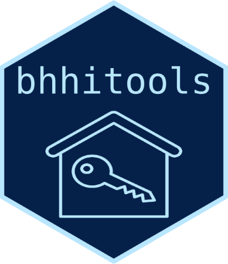

<!-- README.md is generated from README.Rmd. Please edit that file -->

```{r, include = FALSE}
knitr::opts_chunk$set(
  collapse = TRUE,
  comment = "#>",
  fig.path = "man/figures/README-",
  out.width = "100%"
)
```

# bhhitools 

<!-- badges: start -->
[](https://github.com/ucsf-bhhi/bhhitools/actions/workflows/R-CMD-check.yaml)
<!-- badges: end -->

A collection of functions to make R work at BHHI easier.

`bhhitools` simplifies downloading data from REDCap and running Stata code from R.

## Installation

You can install bhhitools from [GitHub](https://github.com/ucsf-bhhi/bhhitools) with:

``` r
# install.packages("remotes")
remotes::install_github("ucsf-bhhi/bhhitools")
```

## REDCap

`bhhitools` can download data from REDCap and automatically convert categorical variables to factor variables while leaving text fields alone.

```{r example}
library(bhhitools)
bhhi_rc_read("BHHITOOLS_DEMO")
```

`bhhitools` also makes it easy to securely store API tokens in your operating system credential vault:

```{r, eval=FALSE} 
bhhi_store_token("EXAMPLE_TOKEN")
```
