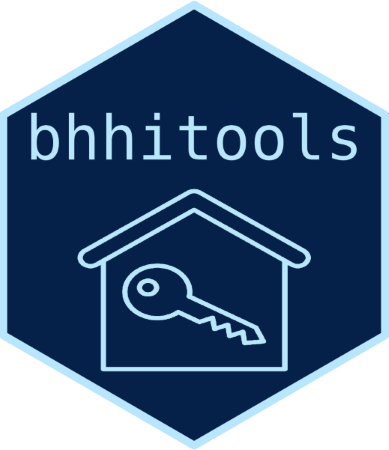

<!-- README.md is generated from README.Rmd. Please edit that file -->

# bhhitools 

<!-- badges: start -->

[](https://github.com/ucsf-bhhi/bhhitools/actions/workflows/R-CMD-check.yaml)
<!-- badges: end -->

A collection of functions to make R work at BHHI easier.

`bhhitools` simplifies downloading data from REDCap and running Stata
code from R.

## Installation

You can install bhhitools from
[GitHub](https://github.com/ucsf-bhhi/bhhitools) with:

``` r
# install.packages("remotes")
remotes::install_github("ucsf-bhhi/bhhitools")
```

## REDCap

`bhhitools` can download data from REDCap and automatically convert
categorical variables to factor variables while leaving text fields
alone.

``` r
library(bhhitools)
bhhi_rc_read("BHHITOOLS_DEMO")
#> # A tibble: 103 × 35
#>    record_id record_id_cf6e98 first_name last_name   address    dob        age  
#>        <int> <chr>            <chr>      <chr>       <chr>      <date>     <chr>
#>  1         1 <NA>             Fulton     Corkery     351 7th S… 2010-11-05 12   
#>  2         2 <NA>             Buck       Ankunding   745 9th S… 1959-08-23 63   
#>  3         3 <NA>             Madelynn   Witting     140 Main … 1981-01-16 42   
#>  4         4 <NA>             Parlee     Macejkovic  286 7th S… 1990-03-26 33   
#>  5         5 <NA>             Eliezer    Brakus      361 8th S… 1951-05-24 72   
#>  6         6 <NA>             Jermain    Jerde       405 4th S… 1969-11-25 53   
#>  7         7 <NA>             Georgie    Brown       461 4th S… 1970-12-28 52   
#>  8         8 <NA>             Armani     Schamberger 123 3rd S… 1983-06-24 40   
#>  9         9 <NA>             Watson     Hettinger   410 3rd S… 1984-04-15 39   
#> 10        10 <NA>             Rosia      Hettinger   344 3rd S… 1962-02-10 61   
#> # ℹ 93 more rows
#> # ℹ 28 more variables: ethnicity <fct>, race <fct>, sex <fct>, height <dbl>,
#> #   weight <int>, bmi <chr>, comments <chr>, venue <fct>,
#> #   gender_identity___0 <lgl>, gender_identity___1 <lgl>,
#> #   gender_identity___2 <lgl>, yes_no <fct>, true_false <fct>,
#> #   demographics_complete <fct>, second_yes_no <fct>, date_dmy <date>,
#> #   date_mdy <date>, date_ymd <date>, datetime_dmy_hm <dttm>, …
```

`bhhitools` also makes it easy to securely store API tokens in your
operating system credential vault:

``` r
bhhi_store_token("EXAMPLE_TOKEN")
```
